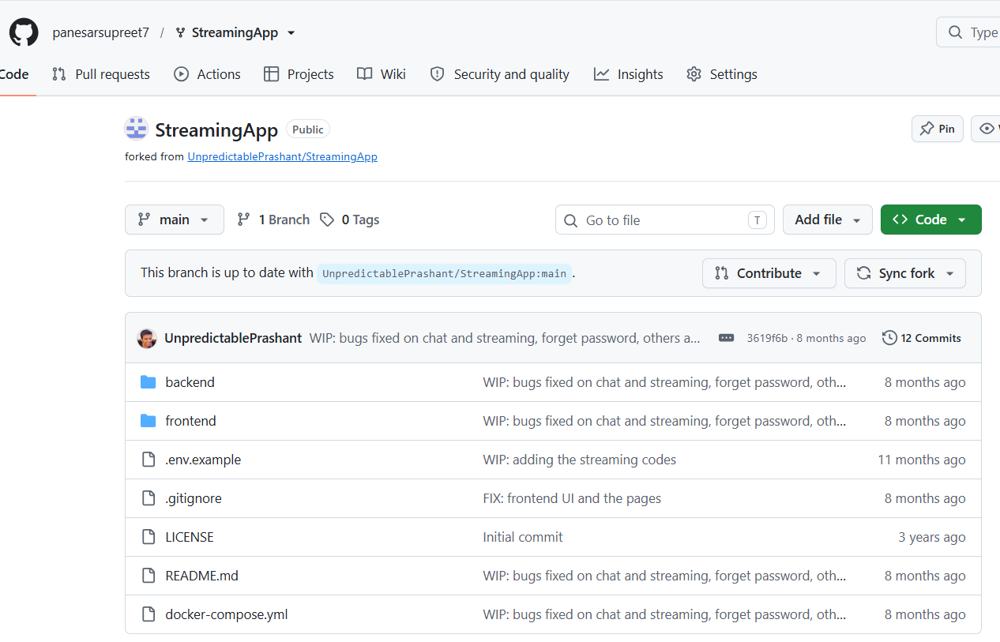
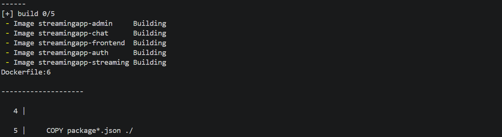
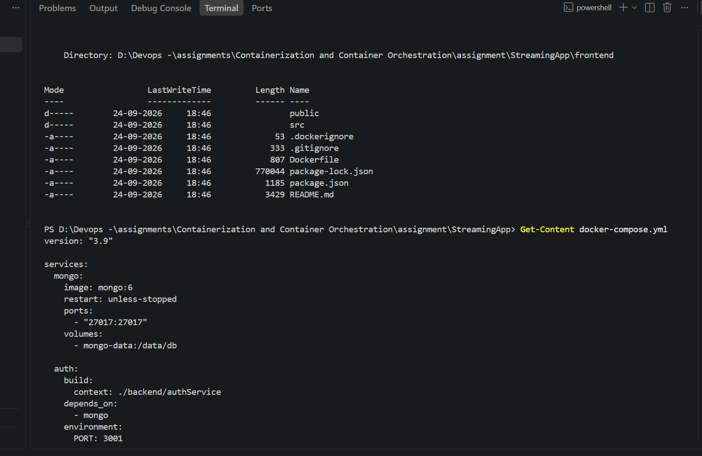
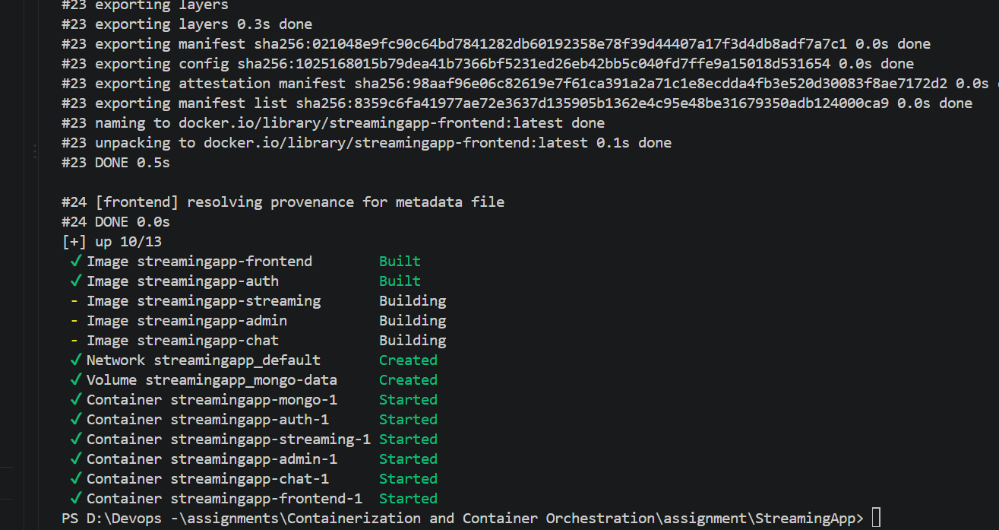
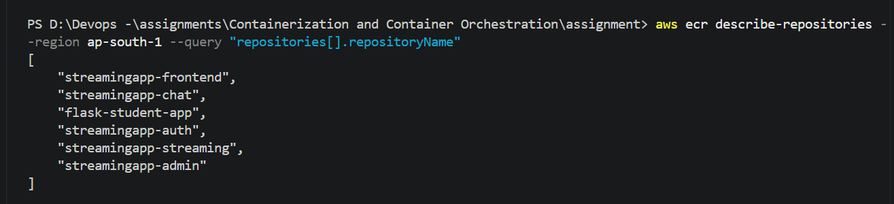
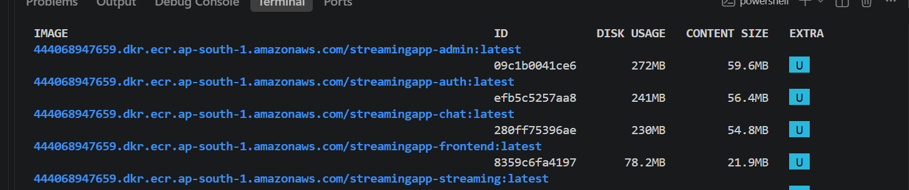

MERN Streaming Application — CI/CD, Docker, EKS, Helm, Monitoring & Logging

1. Project Overview

This project implements a complete containerized deployment and CI/CD workflow for a MERN-based streaming application.

The implementation covers:

GitHub repository setup

Docker image creation for application services

Docker Compose validation

Amazon ECR image repositories

EC2-based Jenkins installation

Jenkins CI/CD pipeline

GitHub webhook / automatic trigger

Docker image build, tag and push

ECR authentication and image pull

Kubernetes deployment on Amazon EKS

Helm chart packaging and deployment

Amazon CloudWatch monitoring

CloudWatch alarms

Centralized application logging through CloudWatch Logs

Kubernetes scaling and post-scaling health validation

2. Overall Architecture

flowchart TB
    DEV["Developer / GitHub Repository"]

    DEV -->|"Git Push"| J["Jenkins on EC2"]

    J -->|"Checkout + Build + Test"| D["Docker Build"]
    D -->|"Tag Images"| ECR["Amazon ECR"]

    ECR -->|"Pull Images"| EKS["Amazon EKS Cluster"]

    subgraph EKS["Amazon EKS - streamingapp-eks"]
        direction TB

        H["Helm Release"]

        F["Frontend Deployment"]
        A["Auth Service"]
        S["Streaming Service"]
        AD["Admin Service"]
        C["Chat Service"]
        M["MongoDB StatefulSet"]

        H --> F
        H --> A
        H --> S
        H --> AD
        H --> C
        H --> M
    end

    J -->|"Helm install / upgrade"| H

    EKS --> CW["Amazon CloudWatch"]
    CW --> MET["Container Insights Metrics"]
    CW --> LOG["CloudWatch Logs"]
    CW --> ALARM["CloudWatch Alarm"]

    EKS -->|"Fluent Bit"| LOG
    EKS -->|"CloudWatch Agent"| MET

    F --> USER["Application User"]
    A --> M
    S --> M
    AD --> M
    C --> M

2.1 Deployment Flow

GitHub
   |
   | Push / Webhook
   v
Jenkins on EC2
   |
   +--> Checkout source
   +--> Install dependencies
   +--> Test
   +--> Docker build
   +--> Tag images
   +--> Push images to ECR
   |
   +--> Helm deployment
            |
            v
       Amazon EKS
            |
     +------+------+------+------+------+
     |      |      |      |      |      |
 Frontend Auth Streaming Admin  Chat   MongoDB
            |
            v
       CloudWatch
       /         \
   Metrics       Logs
      |
   Alarms

3. Repository Setup

The project repository was forked and prepared for the CI/CD implementation.

Screenshot file — 01-fork-repository.png




Verification

The repository was available and contained the application source code before Dockerization and deployment work started.

4. Dockerization

4.1 Build Docker Images

Docker images were created for the application services.

Important command

docker images

Screenshot file — 02-docker-images-built.png




Verification

The required application images were visible locally with the expected repository/tag information.

4.2 Docker Compose Configuration

Docker Compose was used to configure and validate the application services together before the Kubernetes deployment.

Important command

docker compose up -d

To verify the running containers:

docker ps

Screenshot file — 03-docker-compose-configuration.png




Verification

The Docker Compose configuration successfully defined the required services and allowed the application stack to be validated before moving to EKS.

4.3 Docker Image Verification

The created images were verified before pushing them to Amazon ECR.

Important command

docker images

Screenshot file — 04-docker-images-verified.png


Verification

The expected Docker images were present locally and ready for the ECR stage.

4.4 Running Containers Verification

The running containers were checked using:

docker ps

Screenshot file — 05-containers-running.png




Verification

The required application containers were running successfully.

5. Amazon ECR Setup

5.1 Create ECR Repositories

Amazon Elastic Container Registry repositories were created for storing the application Docker images.

Screenshot file — 06-ecr-repositories-created.png




Verification

The required ECR repositories were visible in AWS and ready to receive Docker images.

5.2 Tag Docker Images for ECR

The local images were tagged with the appropriate ECR repository names.

Example command

docker tag <local-image>:<tag> <account-id>.dkr.ecr.ap-south-1.amazonaws.com/<repository>:<tag>

Screenshot file — 07-ecr-images-tagged.png




Verification

The Docker images showed ECR-compatible repository/tag references.

5.3 Push Images to ECR

The images were pushed to Amazon ECR.

Important command

docker push <account-id>.dkr.ecr.ap-south-1.amazonaws.com/<repository>:<tag>

Screenshot file — 08-ecr-images-pushed.png


Verification

The Docker push completed successfully and the images were uploaded to ECR.

5.4 Verify Images in ECR

The images were verified after the push.

Important command

aws ecr describe-images \
  --repository-name <repository> \
  --region ap-south-1

Screenshot file — 09-ecr-images-verified.png


Verification

The expected image tags/digests were available in Amazon ECR.

6. Jenkins CI/CD Server Setup

6.1 Jenkins EC2 Instance

An EC2 instance was prepared to host Jenkins and perform the CI/CD operations.

Screenshot file — 10-jenkins-ec2-instance.png


Verification

The EC2 instance was running and used as the Jenkins server.

6.2 Verify EC2 Operating System

The EC2 operating system was checked from the terminal.

Important command

cat /etc/os-release

Screenshot file — 11-jenkins-ec2-os-check.png


Verification

The expected Linux operating system information was displayed.

6.3 Install Java

Jenkins requires Java.

Important command

java -version

Screenshot file — 12-java-installed.png


Verification

The installed Java version was confirmed successfully.

6.4 Verify Jenkins Service

Jenkins was installed and its service was checked.

Important command

sudo systemctl status jenkins

Screenshot file — 13-jenkins-service-running.png


Verification

The Jenkins service was running successfully.

6.5 Jenkins Security Group

The Jenkins EC2 security group was configured to allow access to Jenkins on port 8080.

Screenshot file — 14-jenkins-security-group-8080.png


Verification

Port 8080 was available for Jenkins web access according to the configured security group.

6.6 Jenkins Initial Unlock

The initial Jenkins unlock screen was completed.

Screenshot file — 15-jenkins-unlock-page.png


6.7 Jenkins Dashboard

After the initial setup, the Jenkins dashboard was accessible.

Screenshot file — 16-jenkins-dashboard.png


Verification

Jenkins was ready to create and execute CI/CD jobs.

7. Docker and AWS Integration on Jenkins EC2

7.1 Docker Installation

Docker was installed on the Jenkins EC2 instance.

Important commands

docker --version

sudo systemctl status docker

Screenshot file — 17-Docker-installed-EC2.png


Verification

Docker was available on the Jenkins EC2 server and could be used by Jenkins jobs.

7.2 IAM Role for ECR Access

An IAM role was associated with the Jenkins EC2 instance so the server could interact with AWS services without storing long-lived AWS access keys on the server.

Screenshot file — 18-jenkins-ecr-iam-role.png


Verification

The EC2 instance had an IAM role with the required AWS permissions for the CI/CD workflow.

7.3 ECR Docker Login

The Jenkins EC2 instance authenticated Docker with Amazon ECR.

Important command

aws ecr get-login-password --region ap-south-1 | \
docker login \
--username AWS \
--password-stdin <account-id>.dkr.ecr.ap-south-1.amazonaws.com

Screenshot file — 19-EC2-ECR-Docker-login.png


Verification

Docker authentication against ECR completed successfully.

8. Jenkins CI/CD Pipeline

The Jenkins pipeline automates the application build and deployment workflow.

8.1 Jenkins ECR Push

The Jenkins job built the required images and pushed them to ECR.

Screenshot file — 20-Jenkins-ECR-Push-Success.png


Verification

The Jenkins job completed the ECR push stage successfully.

8.2 Automatic GitHub Trigger

GitHub was connected to Jenkins so that repository changes could automatically trigger the pipeline.

Screenshot file — 21-Jenkins-Automatic-GitHub-Trigger-Success.png


Verification

A GitHub repository change successfully triggered the Jenkins pipeline automatically.

8.3 Jenkins Console Output

The Jenkins console output was checked to verify the pipeline stages.

Important command / location

Jenkins job:

Jenkins Dashboard → Job → Build → Console Output

Screenshot file — 22-Jenkins_Console-output-Success.png


Verification

The console output confirmed successful execution of the required pipeline operations.

9. ECR and EC2 Deployment Verification

9.1 Verify Images in ECR

The pushed images were checked from Amazon ECR.

Screenshot file — 23-ECR-Images-Pushed.png


Verification

The expected application images were available in the ECR repositories.

9.2 Pull Images from ECR on EC2

The deployment server pulled the required images from ECR.

Important command

docker pull <account-id>.dkr.ecr.ap-south-1.amazonaws.com/<repository>:<tag>

Screenshot file — 24-EC2-ECR-Images-Pulled.png


Verification

The required ECR images were successfully available on the EC2 host.

9.3 Verify Running Docker Containers

The application containers were checked after deployment.

Important command

docker ps

Screenshot file — 25-EC2-Docker-Containers-Running.png


Verification

The expected containers were running successfully.

9.4 Verify Frontend Application

The frontend application was opened and verified from the browser.

Screenshot file — 26-Frontend-Application-Running.png


Verification

The frontend was reachable and displayed the streaming application successfully.

10. Amazon EKS Setup

10.1 Install / Verify EKS Tooling

The EKS environment was prepared on the deployment host.

Important commands

aws --version

kubectl version --client

eksctl version

Screenshot file — 27-EKS-Installed.png


Verification

The required AWS/Kubernetes tooling was available for EKS administration.

10.2 EKS Cluster and Node Group

The EKS cluster was created with a worker node group.

Cluster name:

streamingapp-eks

Region:

ap-south-1

Important commands

aws eks update-kubeconfig \
  --region ap-south-1 \
  --name streamingapp-eks

kubectl get nodes

Screenshot file — 28-EKS-Cluster-Nodegroup-Ready.png


Verification

The EKS cluster was reachable and the worker node group was ready.

11. Kubernetes Deployment

11.1 Verify EKS Pods

The application pods were checked after deployment.

Important command

kubectl get pods -A

For the application namespace:

kubectl get pods

Screenshot file — 29-All-EKS-Pods-Running-Successfully.png


Verification

The required Kubernetes workloads reached the expected running/ready state.

11.2 Verify Kubernetes Resources

The deployed Kubernetes resources were checked.

Important commands

kubectl get deployments

kubectl get services

kubectl get pods

kubectl get ingress

Screenshot file — 30-Kubernetes-Clusters-Deployed.png


Verification

The application resources were successfully deployed to the EKS cluster.

12. Helm Deployment

The Kubernetes manifests were packaged as a Helm chart so that deployment configuration could be managed through values.yaml.

12.1 Helm Chart Structure

The Helm chart contains the chart definition, configurable values and Kubernetes templates.

Typical structure:

streamingapp/
├── Chart.yaml
├── values.yaml
└── templates/
    ├── auth-deployment.yaml
    ├── auth-service.yaml
    ├── streaming-deployment.yaml
    ├── streaming-service.yaml
    ├── admin-deployment.yaml
    ├── chat-deployment.yaml
    ├── frontend-deployment.yaml
    ├── mongo-statefulset.yaml
    ├── configmap.yaml
    ├── secret.yaml
    └── ingress.yaml

values.yaml contains configurable values such as image repositories, image tags, replica counts, ports, MongoDB storage size and ingress host.

12.2 Helm Commands

Verify Helm:

helm version

Validate the chart:

helm lint ./streamingapp

Preview the generated Kubernetes manifests:

helm template streamingapp ./streamingapp

Install the chart:

helm install streamingapp ./streamingapp

Or upgrade an existing release:

helm upgrade streamingapp ./streamingapp

Verify the Helm release:

helm list

helm status streamingapp

Screenshot file — 31-Helm-Deployment.png


Verification

The Helm release was deployed successfully and the resulting Kubernetes resources were running in the EKS cluster.

13. Step 6 — Monitoring and Logging

13.1 Amazon CloudWatch Observability Add-on

Amazon CloudWatch Observability was enabled for the EKS cluster.

Important commands

aws eks create-addon \
  --cluster-name streamingapp-eks \
  --addon-name amazon-cloudwatch-observability \
  --region ap-south-1

Check the add-on:

aws eks describe-addon \
  --cluster-name streamingapp-eks \
  --addon-name amazon-cloudwatch-observability \
  --region ap-south-1 \
  --query 'addon.status' \
  --output text

Expected status:

ACTIVE

Verify the CloudWatch namespace:

kubectl get pods -n amazon-cloudwatch

Verification

The CloudWatch agent, Fluent Bit and CloudWatch observability components were running in the amazon-cloudwatch namespace.

13.2 CloudWatch Metrics

Container Insights metrics were checked from CloudWatch.

Important command

aws cloudwatch list-metrics \
  --namespace ContainerInsights \
  --region ap-south-1 \
  --query 'Metrics[].MetricName' \
  --output text

Metrics observed included Kubernetes/container-related metrics such as:

pod_status_unknown
replicas_desired
replicas_ready
rest_client_request_duration_seconds
rest_client_requests_total
service_number_of_running_pods
status_replicas_available
status_replicas_unavailable

13.3 Configure CloudWatch Alarm

A CloudWatch alarm was configured for high node CPU utilization.

Important command

aws cloudwatch put-metric-alarm \
  --alarm-name streamingapp-node-cpu-high \
  --namespace ContainerInsights \
  --metric-name node_cpu_utilization \
  --dimensions Name=ClusterName,Value=streamingapp-eks Name=NodeName,Value=ip-192-168-57-42.ap-south-1.compute.internal \
  --statistic Average \
  --period 300 \
  --evaluation-periods 2 \
  --threshold 80 \
  --comparison-operator GreaterThanThreshold \
  --region ap-south-1

Screenshot file — 32-CloudWatch-Alarm.png


Verification

The CloudWatch alarm was visible in the AWS console with the configured metric, threshold and evaluation period.

14. Centralized Logging

14.1 CloudWatch Log Groups

CloudWatch Logs were used to centralize Kubernetes application and infrastructure logs.

The CloudWatch Observability add-on created/used log groups under:

/aws/containerinsights/streamingapp-eks/

The relevant log groups included:

/aws/containerinsights/streamingapp-eks/application
/aws/containerinsights/streamingapp-eks/dataplane
/aws/containerinsights/streamingapp-eks/host

Important command

aws logs describe-log-groups \
  --region ap-south-1 \
  --query 'logGroups[].logGroupName' \
  --output table

Screenshot file — 33-Centralized-Logging.png


Verification

The EKS cluster log groups were present in CloudWatch and were receiving centralized log streams.

14.2 Verify Application Log Streams

Application log streams were checked directly from the CloudWatch log group.

Important command

aws logs describe-log-streams \
  --log-group-name /aws/containerinsights/streamingapp-eks/application \
  --region ap-south-1 \
  --query 'logStreams[].logStreamName' \
  --output table

The returned streams included Kubernetes container log streams for application workloads and CloudWatch/Fluent Bit components.

Screenshot file — 34-Centralize-application-logs-using-CloudWatch-Logs.png


Verification

Application/container log streams were visible under the EKS CloudWatch application log group, demonstrating centralized log collection.

15. Step 8 — Final Validation

15.1 Frontend Validation

The frontend application was accessed through the deployed application endpoint.

Screenshot file — 26-Frontend-Application-Running.png


Verification

The frontend was reachable and the application UI loaded successfully.

15.2 Kubernetes Health Validation

The Kubernetes resources were checked using:

kubectl get pods

kubectl get deployments

kubectl get services

kubectl get ingress

The application pods were expected to be Running and Ready.

15.3 Scaling Validation

The application was scaled to verify that Kubernetes could create additional replicas and maintain application health.

Important command

Example:

kubectl scale deployment <deployment-name> --replicas=3

Then verify:

kubectl get pods -o wide

Verify the deployment:

kubectl get deployment <deployment-name>

The desired and available replica counts should match after the scaling operation completes.

To inspect the rollout:

kubectl rollout status deployment/<deployment-name>

Screenshot file — 35-Application-healthy-after-scaling.png


Verification

The application remained healthy after the scaling operation and the expected replicas became available.

16. Important Kubernetes Commands Used During Validation

Check all nodes:

kubectl get nodes

Check all pods:

kubectl get pods -A

Check application pods:

kubectl get pods

Check deployments:

kubectl get deployments

Check services:

kubectl get services

Check ingress:

kubectl get ingress

Check pod details:

kubectl describe pod <pod-name>

Check pod logs:

kubectl logs <pod-name>

Follow logs:

kubectl logs -f <pod-name>

Restart a deployment:

kubectl rollout restart deployment <deployment-name>

Check rollout:

kubectl rollout status deployment/<deployment-name>

Scale a deployment:

kubectl scale deployment <deployment-name> --replicas=3

17. Important Helm Commands

Check Helm:

helm version

List releases:

helm list

Check release status:

helm status streamingapp

Validate chart:

helm lint ./streamingapp

Render templates locally:

helm template streamingapp ./streamingapp

Install:

helm install streamingapp ./streamingapp

Upgrade:

helm upgrade streamingapp ./streamingapp

List release history:

helm history streamingapp

18. Important Docker Commands

Check Docker:

docker --version

List images:

docker images

List running containers:

docker ps

Build an image:

docker build -t <image-name>:<tag> .

Tag an image for ECR:

docker tag <image-name>:<tag> \
<account-id>.dkr.ecr.ap-south-1.amazonaws.com/<repository>:<tag>

Login to ECR:

aws ecr get-login-password --region ap-south-1 | \
docker login \
--username AWS \
--password-stdin <account-id>.dkr.ecr.ap-south-1.amazonaws.com

Push an image:

docker push \
<account-id>.dkr.ecr.ap-south-1.amazonaws.com/<repository>:<tag>

Pull an image:

docker pull \
<account-id>.dkr.ecr.ap-south-1.amazonaws.com/<repository>:<tag>

19. Important AWS / CloudWatch Commands

Check EKS cluster:

aws eks describe-cluster \
  --name streamingapp-eks \
  --region ap-south-1

Update kubeconfig:

aws eks update-kubeconfig \
  --region ap-south-1 \
  --name streamingapp-eks

List EKS add-ons:

aws eks list-addons \
  --cluster-name streamingapp-eks \
  --region ap-south-1

Check CloudWatch Observability add-on:

aws eks describe-addon \
  --cluster-name streamingapp-eks \
  --addon-name amazon-cloudwatch-observability \
  --region ap-south-1 \
  --query 'addon.status' \
  --output text

List CloudWatch log groups:

aws logs describe-log-groups \
  --region ap-south-1 \
  --query 'logGroups[].logGroupName' \
  --output table

List application log streams:

aws logs describe-log-streams \
  --log-group-name /aws/containerinsights/streamingapp-eks/application \
  --region ap-south-1 \
  --query 'logStreams[].logStreamName' \
  --output table

List Container Insights metrics:

aws cloudwatch list-metrics \
  --namespace ContainerInsights \
  --region ap-south-1 \
  --query 'Metrics[].MetricName' \
  --output text

20. Assignment Completion Checklist

Requirement

Implementation

Validation

Repository setup

GitHub repository

01-fork-repository.png

Docker images

Docker build

02-docker-images-built.png

Docker Compose

Compose configuration

03-docker-compose-configuration.png

Image verification

docker images

04-docker-images-verified.png

Containers

docker ps

05-containers-running.png

ECR repositories

Amazon ECR

06-ecr-repositories-created.png

ECR tagging

Docker tag

07-ecr-images-tagged.png

ECR push

Docker push

08-ecr-images-pushed.png

ECR verification

ECR image listing

09-ecr-images-verified.png

Jenkins

Jenkins on EC2

10–16

Docker on Jenkins

Docker on EC2

17-Docker-installed-EC2.png

AWS access

IAM role

18-jenkins-ecr-iam-role.png

ECR authentication

Docker/ECR login

19-EC2-ECR-Docker-login.png

Jenkins CI/CD

Automated pipeline

20–22

ECR deployment

Pull images

23–25

Application

Frontend reachable

26-Frontend-Application-Running.png

EKS

Cluster/node group

27–28

Kubernetes

Pods/resources

29–30

Helm

Helm release

31-Helm-Deployment.png

CloudWatch monitoring

Metrics + alarm

32-CloudWatch-Alarm.png

Centralized logging

CloudWatch Logs

33–34

Scaling validation

Application health after scaling

35-Application-healthy-after-scaling.png

21. Final Result

The completed solution provides a full deployment path from source code to a running Kubernetes application:

GitHub
  ↓
Jenkins
  ↓
Docker Build
  ↓
Amazon ECR
  ↓
Amazon EKS
  ↓
Helm Deployment
  ↓
Frontend + Backend Services + MongoDB
  ↓
CloudWatch Metrics + Alarms
  ↓
CloudWatch Centralized Logs

The final deployment was validated through Docker, Jenkins, ECR, Kubernetes, Helm, CloudWatch monitoring, centralized logging and post-scaling health checks.

All screenshots referenced in this document are stored in the repository's screenshots/ directory and are linked using relative Markdown paths so GitHub renders them directly in the README.


# StreamingApp

Stream premium video content, host live watch parties, and manage your catalogue with a modern microservice architecture. The platform now ships with a production-ready admin portal, real-time chat, S3-backed adaptive streaming, and a redesigned cinematic frontend experience.

## Architecture

| Service | Port | Description |
| --- | --- | --- |
| `authService` | 3001 | User authentication, registration, JWT issuance |
| `streamingService` | 3002 | Video catalogue, S3 playback endpoints, public APIs |
| `adminService` | 3003 | Dedicated admin microservice for asset management and uploads |
| `chatService` | 3004 | Websocket + REST chat for live watch parties |
| `frontend` | 3000 | React SPA with revamped UI and integrated chat |
| `mongo` | 27017 | Shared MongoDB instance |

All backend services share common database models and utilities through `backend/common`.

## Environment Configuration

Create an `.env` for each service (or export variables before running). All services accept the standard AWS credentials for S3 access.

### Auth Service (`backend/authService/.env`)
```ini
PORT=3001
MONGO_URI=mongodb://localhost:27017/streamingapp
JWT_SECRET=changeme
CLIENT_URLS=http://localhost:3000
AWS_ACCESS_KEY_ID=
AWS_SECRET_ACCESS_KEY=
AWS_REGION=ap-south-1
AWS_S3_BUCKET=
```

### Streaming Service (`backend/streamingService/.env`)
```ini
PORT=3002
MONGO_URI=mongodb://localhost:27017/streamingapp
JWT_SECRET=changeme
CLIENT_URLS=http://localhost:3000
AWS_ACCESS_KEY_ID=
AWS_SECRET_ACCESS_KEY=
AWS_REGION=ap-south-1
AWS_S3_BUCKET=
AWS_CDN_URL=
STREAMING_PUBLIC_URL=http://localhost:3002
```

### Admin Service (`backend/adminService/.env`)
```ini
PORT=3003
MONGO_URI=mongodb://localhost:27017/streamingapp
JWT_SECRET=changeme
CLIENT_URLS=http://localhost:3000
AWS_ACCESS_KEY_ID=
AWS_SECRET_ACCESS_KEY=
AWS_REGION=ap-south-1
AWS_S3_BUCKET=
```

### Chat Service (`backend/chatService/.env`)
```ini
PORT=3004
MONGO_URI=mongodb://localhost:27017/streamingapp
JWT_SECRET=changeme
CLIENT_URLS=http://localhost:3000
```

### Frontend build variables (`frontend/.env` or Docker build args)
```ini
REACT_APP_AUTH_API_URL=http://localhost:3001/api
REACT_APP_STREAMING_API_URL=http://localhost:3002/api
REACT_APP_STREAMING_PUBLIC_URL=http://localhost:3002
REACT_APP_ADMIN_API_URL=http://localhost:3003/api/admin
REACT_APP_CHAT_API_URL=http://localhost:3004/api/chat
REACT_APP_CHAT_SOCKET_URL=http://localhost:3004
```

## Running with Docker Compose

1. Populate the environment variables above (or rely on the defaults baked into `docker-compose.yml`).
2. Build and start the stack:
   ```bash
   docker-compose up --build
   ```
3. Navigate to `http://localhost:3000` for the web app.

The compose file provisions MongoDB plus all four Node.js microservices. S3 credentials are optional for local testing—you can still browse seeded metadata, but streaming requires valid S3 objects.

## Local Development

Install dependencies for each service:

```bash
# auth service
cd backend/authService && npm install

# streaming service
cd ../streamingService && npm install

# admin service
cd ../adminService && npm install

# chat service
cd ../chatService && npm install

# frontend
cd ../../frontend && npm install
```

Run the services (in separate terminals) after starting MongoDB:

```bash
cd backend/authService && npm run dev
cd backend/streamingService && npm run dev
cd backend/adminService && npm run dev
cd backend/chatService && npm run dev
cd frontend && npm start
```

## Feature Highlights

- **S3-backed adaptive streaming** with secure signed uploads for admins.
- **Dedicated admin microservice** for video ingestion, metadata management, and featured curation.
- **Real-time chat** overlay in the player (Socket.IO + persistent message history).
- **Modern React experience** featuring cinematic hero sections, dynamic carousels, and responsive design.
- **Role-aware access control** across frontend routes and backend microservices.

## Testing

Automated tests are not yet included. Recommended smoke checks:

1. Register and log in through the web UI.
2. Upload a small video + thumbnail via the admin dashboard (requires valid S3 credentials).
3. Confirm playback from the browse page and verify that chat messages broadcast between multiple browser tabs.

## License

MIT © StreamFlix Team
