# MERN Streaming Application — DevOps Deployment Project

This project demonstrates the complete DevOps implementation of a MERN-based streaming application using Docker, Amazon ECR, Jenkins, Amazon EKS, Kubernetes, Helm, Amazon CloudWatch monitoring, centralized logging, and application scaling.

---

# Step 1 — Fork Repository

The project repository was forked from the original GitHub repository to create an independent copy for the DevOps implementation.


**Verification**

The repository was successfully forked and was available under the GitHub account for further implementation.

---

# Step 2 — Build Docker Images

Docker images were created for the application services.

**Important command**

```bash
docker images
```


**Verification**

The required application Docker images were successfully built and were available locally.

---

# Step 3 — Configure Docker Compose

Docker Compose was configured to run the application services together.

**Important command**

```bash
docker-compose up -d
```


**Verification**

The Docker Compose configuration was successfully created for the application stack.

---

# Step 4 — Verify Docker Images

The locally created Docker images were verified before pushing them to Amazon ECR.

**Important command**

```bash
docker images
```


**Verification**

All required Docker images were available with their respective repository names and tags.

---

# Step 5 — Verify Running Containers

The application containers were checked to verify that they were running successfully.

**Important command**

```bash
docker ps
```


**Verification**

The required application containers were running successfully.

---

# Step 6 — Create Amazon ECR Repositories

Amazon Elastic Container Registry repositories were created to store the Docker images.


**Verification**

The required ECR repositories were successfully created and were ready to receive Docker images.

---

# Step 7 — Tag Docker Images for ECR

The locally created Docker images were tagged with the Amazon ECR repository URL.

**Important command**

```bash
docker tag <local-image>:<tag> <account-id>.dkr.ecr.ap-south-1.amazonaws.com/<repository>:<tag>
```


**Verification**

The Docker images were successfully tagged with the appropriate ECR repository and tag.

---

# Step 8 — Push Images to ECR

The Docker images were pushed to Amazon ECR.

**Important command**

```bash
docker push <account-id>.dkr.ecr.ap-south-1.amazonaws.com/<repository>:<tag>
```

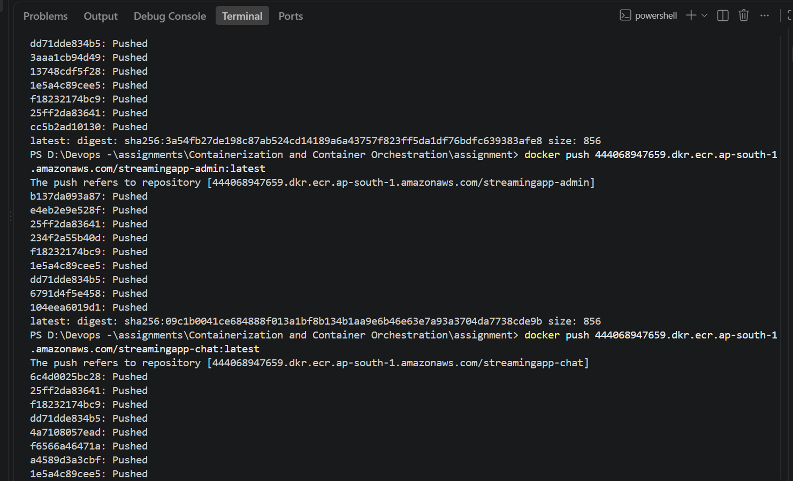

**Verification**

The Docker push completed successfully and the images were uploaded to Amazon ECR.

---

# Step 9 — Verify Images in ECR

The images stored in Amazon ECR were verified after the push operation.

**Important command**

```bash
aws ecr describe-images \
  --repository-name <repository> \
  --region ap-south-1
```

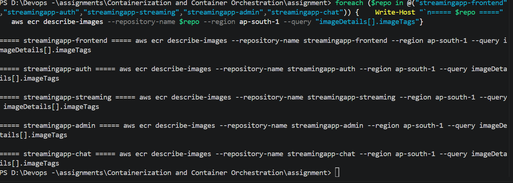

**Verification**

The expected Docker images and tags were visible in the ECR repositories.

---

# Step 10 — Create Jenkins EC2 Instance

An EC2 instance was created to host the Jenkins CI/CD server.

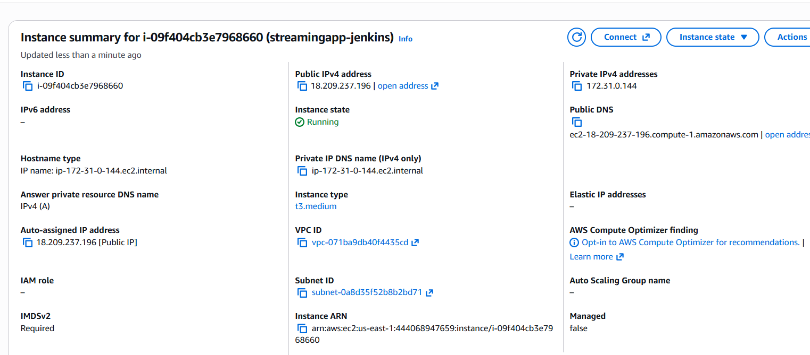

**Verification**

The Jenkins EC2 instance was successfully created and was running.

---

# Step 11 — Verify Jenkins EC2 Operating System

The operating system of the Jenkins EC2 instance was verified.

**Important command**

```bash
cat /etc/os-release
```

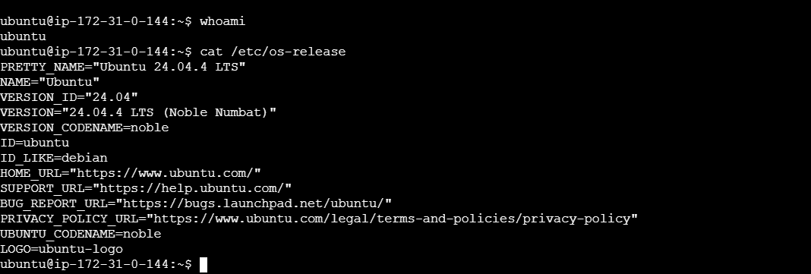

**Verification**

The EC2 operating system information was displayed successfully.

---

# Step 12 — Install Java

Java was installed on the Jenkins EC2 instance because Jenkins requires Java.

**Important command**

```bash
java -version
```

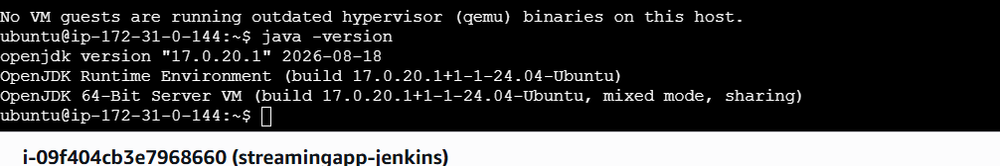

**Verification**

The installed Java version was successfully verified.

---

# Step 13 — Verify Jenkins Service

The Jenkins service was checked after installation.

**Important command**

```bash
sudo systemctl status jenkins
```

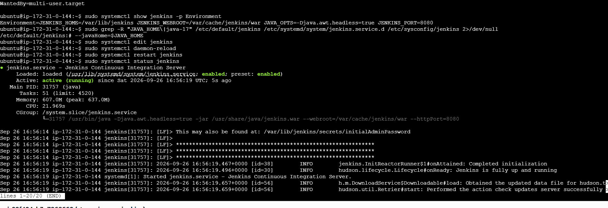

**Verification**

The Jenkins service was running successfully.

---

# Step 14 — Configure Jenkins Security Group

The Jenkins EC2 security group was configured to allow access to Jenkins through port `8080`.

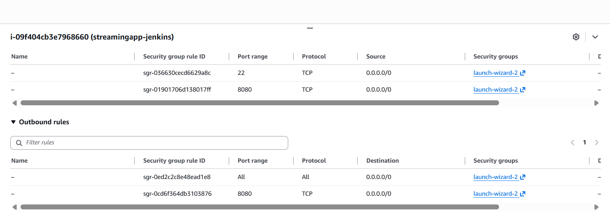

**Verification**

Port `8080` was configured in the security group for Jenkins web access.

---

# Step 15 — Jenkins Initial Unlock

The Jenkins initial unlock page was accessed during the first-time Jenkins setup.

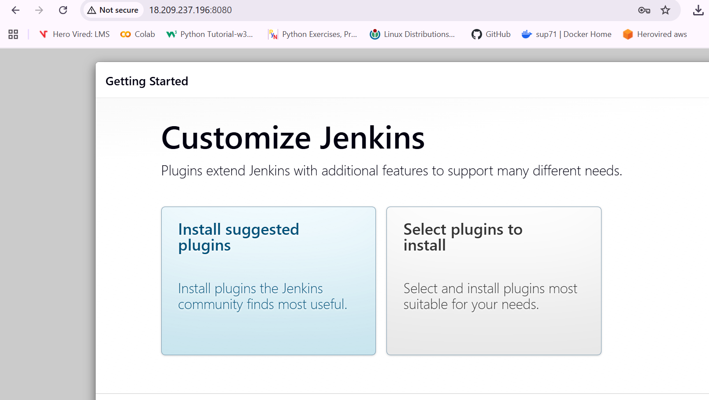

**Verification**

The initial Jenkins setup was successfully completed.

---

# Step 16 — Jenkins Dashboard

The Jenkins dashboard was accessed after completing the initial setup.

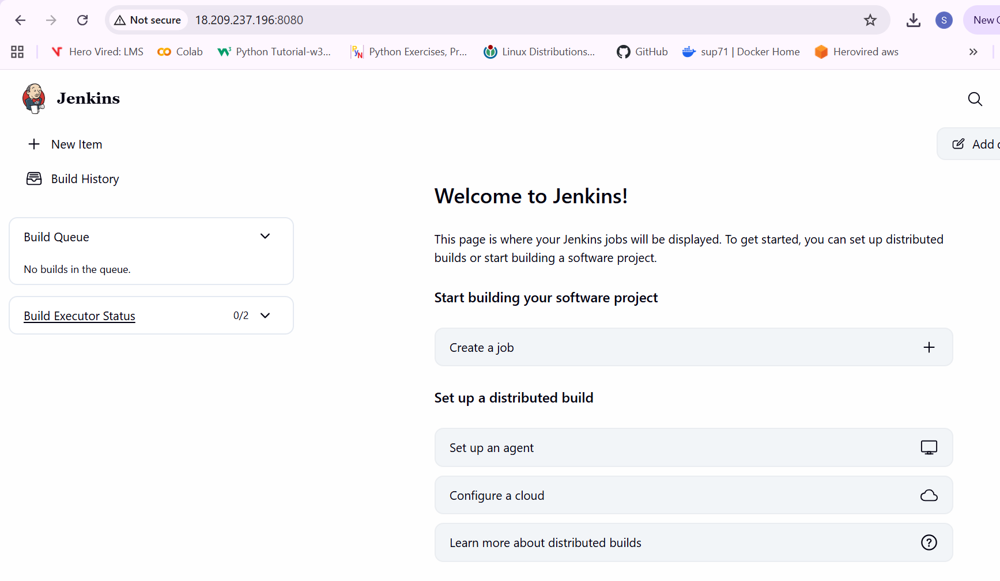

**Verification**

The Jenkins dashboard was available and ready for CI/CD job configuration.

---

# Step 17 — Install Docker on Jenkins EC2

Docker was installed on the Jenkins EC2 instance so Jenkins could build, tag, push, and manage Docker images.

**Important commands**

```bash
docker --version
```

```bash
sudo systemctl status docker
```

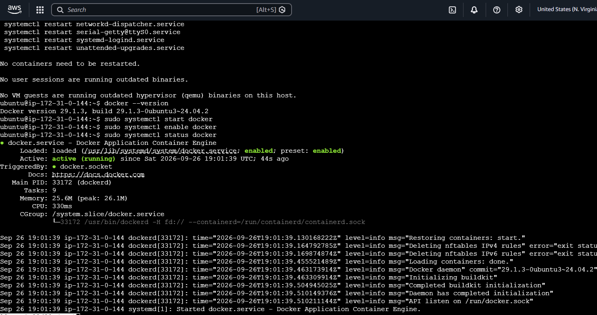

**Verification**

Docker was successfully installed and available on the Jenkins EC2 instance.

---

# Step 18 — Configure Jenkins ECR IAM Role

An IAM role was configured for the Jenkins EC2 instance to allow the server to interact with Amazon ECR.

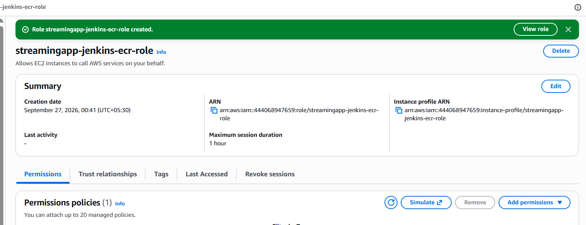

**Verification**

The Jenkins EC2 instance had the required IAM permissions for ECR operations.

---

# Step 19 — Authenticate EC2 with Amazon ECR

Docker on the Jenkins EC2 instance was authenticated with Amazon ECR.

**Important command**

```bash
aws ecr get-login-password --region ap-south-1 | \
docker login \
  --username AWS \
  --password-stdin <account-id>.dkr.ecr.ap-south-1.amazonaws.com
```

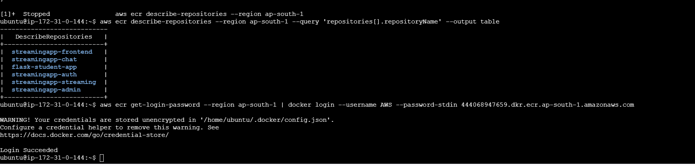

**Verification**

Docker successfully authenticated with the Amazon ECR registry.

---

# Step 20 — Jenkins ECR Push

The Jenkins pipeline was configured to build Docker images and push them to Amazon ECR.

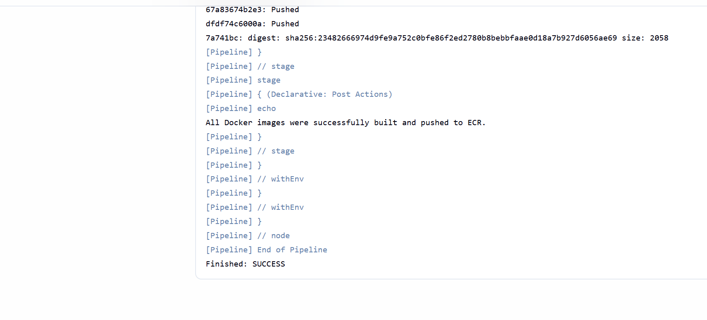

**Verification**

The Jenkins job successfully completed the ECR image push operation.

---

# Step 21 — Configure Automatic GitHub Trigger

GitHub was integrated with Jenkins so that changes pushed to the repository could automatically trigger the Jenkins pipeline.

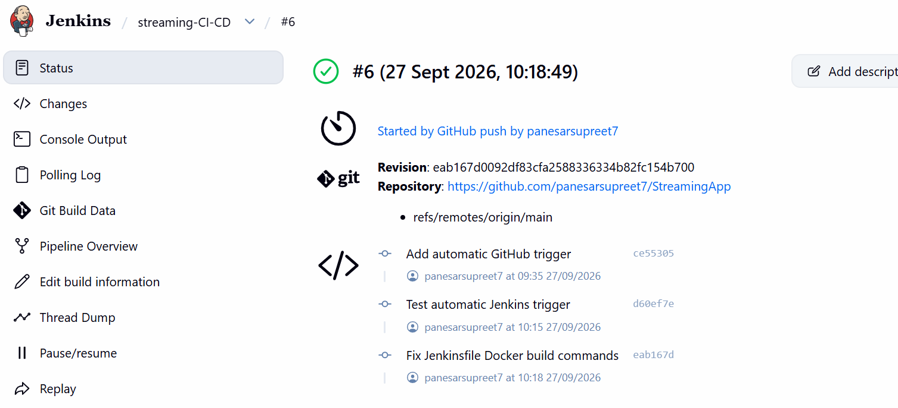

**Verification**

The Jenkins pipeline was automatically triggered following a GitHub repository change.

---

# Step 22 — Verify Jenkins Console Output

The Jenkins console output was checked to verify successful pipeline execution.

**Important location**

```text
Jenkins Dashboard
    ↓
Jenkins Job
    ↓
Build
    ↓
Console Output
```

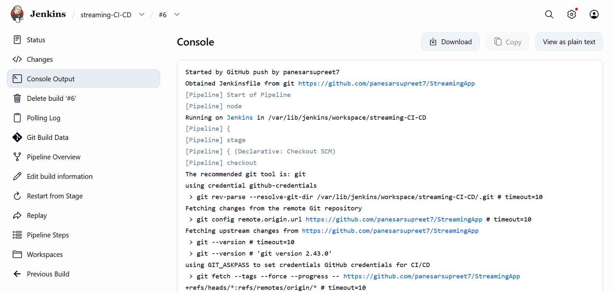

**Verification**

The Jenkins console output confirmed successful execution of the configured pipeline.

---

# Step 23 — Verify ECR Images

The Docker images pushed by Jenkins were verified in Amazon ECR.

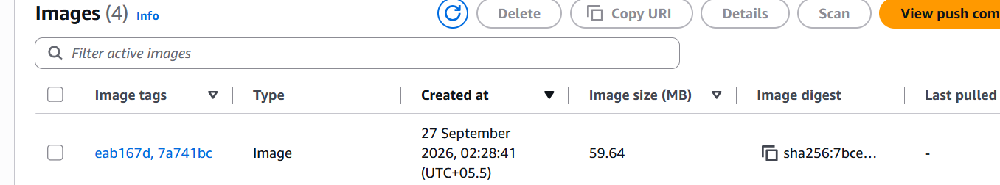

**Verification**

The expected application images were available in the ECR repositories.

---

# Step 24 — Pull ECR Images on EC2

The Docker images were pulled from Amazon ECR onto the EC2 deployment host.

**Important command**

```bash
docker pull <account-id>.dkr.ecr.ap-south-1.amazonaws.com/<repository>:<tag>
```

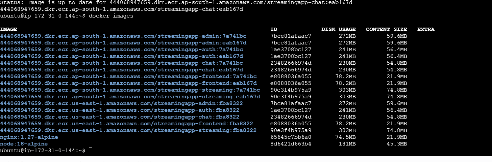

**Verification**

The required ECR images were successfully pulled onto the EC2 instance.

---

# Step 25 — Verify Docker Containers on EC2

The application containers were checked after pulling and running the images.

**Important command**

```bash
docker ps
```

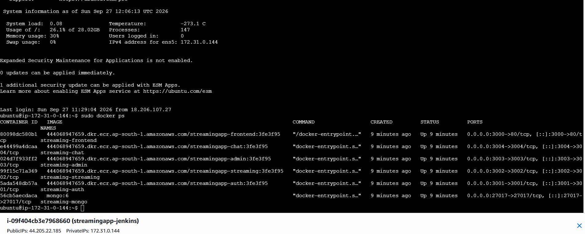

**Verification**

The required application containers were running successfully on the EC2 instance.

---

# Step 26 — Verify Frontend Application

The deployed frontend application was accessed through the browser.

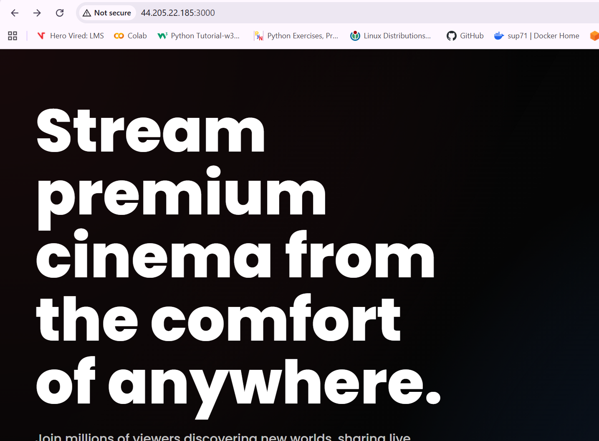

**Verification**

The frontend application was successfully running and accessible.

---

# Step 27 — Install and Verify EKS Tools

The required AWS and Kubernetes tools were installed and verified before creating the EKS environment.

**Important commands**

```bash
aws --version
```

```bash
kubectl version --client
```

```bash
eksctl version
```

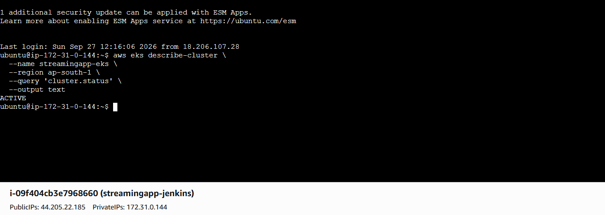

**Verification**

The required EKS management tools were successfully installed and available.

---

# Step 28 — Create EKS Cluster and Node Group

The Amazon EKS cluster and worker node group were created.

**Cluster name**

```text
streamingapp-eks
```

**Region**

```text
ap-south-1
```

**Important command**

```bash
aws eks update-kubeconfig \
  --region ap-south-1 \
  --name streamingapp-eks
```

**Verify nodes**

```bash
kubectl get nodes
```

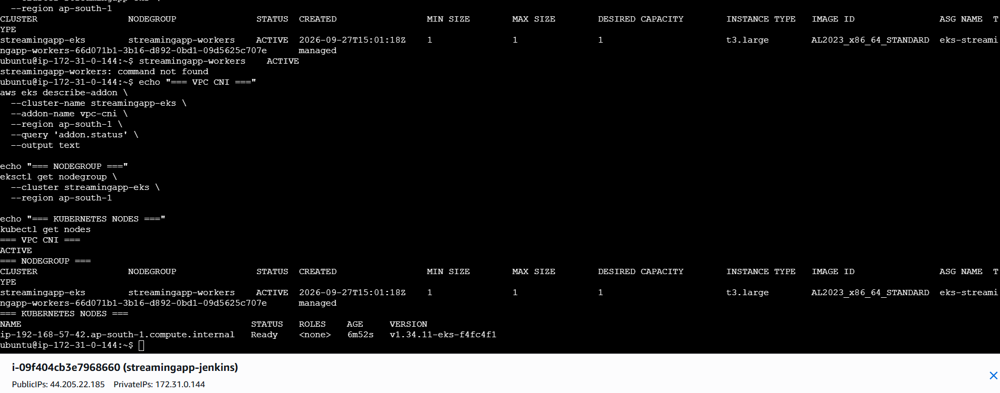

**Verification**

The EKS cluster was accessible and the worker node group was ready.

---

# Step 29 — Verify All EKS Pods

The Kubernetes pods were checked after deploying the application to EKS.

**Important command**

```bash
kubectl get pods -A
```

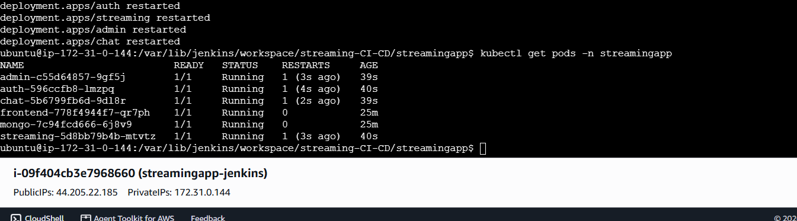

**Verification**

The required Kubernetes pods were running successfully.

---

# Step 30 — Verify Kubernetes Resources

The Kubernetes deployments, services, and ingress resources were checked.

**Important commands**

```bash
kubectl get deployments
```

```bash
kubectl get services
```

```bash
kubectl get ingress
```

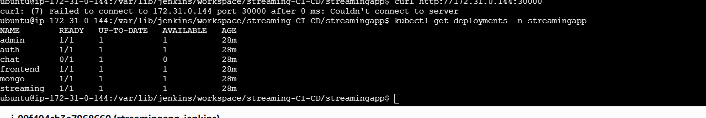

**Verification**

The application resources were successfully deployed to the EKS cluster.

---

# Step 31 — Deploy Application Using Helm

Helm was used to package and deploy the Kubernetes application.

### Step 31.1 — Verify Helm

```bash
helm version
```

### Step 31.2 — Validate Helm Chart

```bash
helm lint ./streamingapp
```

### Step 31.3 — Preview Kubernetes Resources

```bash
helm template streamingapp ./streamingapp
```

### Step 31.4 — Install Helm Release

```bash
helm install streamingapp ./streamingapp
```

### Step 31.5 — Verify Helm Release

```bash
helm list
```

```bash
helm status streamingapp
```

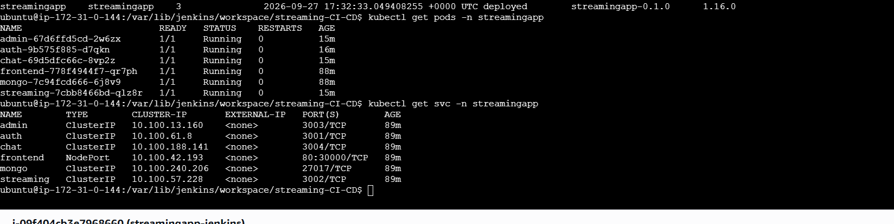

**Verification**

The Helm release was successfully deployed and the application resources were running in the EKS cluster.

---

# Step 32 — Configure CloudWatch Alarm

Amazon CloudWatch was configured to monitor the EKS environment.

A CloudWatch alarm was configured for high node CPU utilization.

**Important command**

```bash
aws cloudwatch put-metric-alarm \
  --alarm-name streamingapp-node-cpu-high \
  --namespace ContainerInsights \
  --metric-name node_cpu_utilization \
  --dimensions Name=ClusterName,Value=streamingapp-eks \
  --statistic Average \
  --period 300 \
  --evaluation-periods 2 \
  --threshold 80 \
  --comparison-operator GreaterThanThreshold \
  --region ap-south-1
```

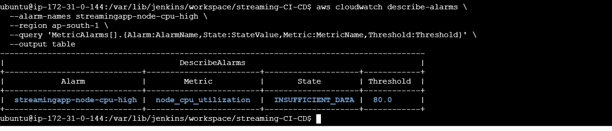

**Verification**

The CloudWatch alarm was successfully configured for monitoring node CPU utilization.

---

# Step 33 — Configure Centralized Logging

Amazon CloudWatch Logs was configured to centralize Kubernetes and application logs.

The main application log group was:

```text
/aws/containerinsights/streamingapp-eks/application
```

Other EKS log groups included:

```text
/aws/containerinsights/streamingapp-eks/dataplane
```

```text
/aws/containerinsights/streamingapp-eks/host
```

**Important command**

```bash
aws logs describe-log-groups \
  --region ap-south-1 \
  --query 'logGroups[].logGroupName' \
  --output table
```

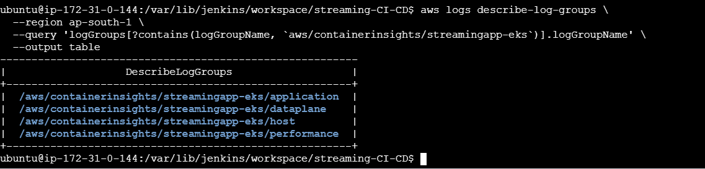

**Verification**

The EKS CloudWatch log groups were available and receiving centralized logs.

---

# Step 34 — Verify Application Logs in CloudWatch

Application log streams were checked directly from the CloudWatch application log group.

**Important command**

```bash
aws logs describe-log-streams \
  --log-group-name /aws/containerinsights/streamingapp-eks/application \
  --region ap-south-1 \
  --query 'logStreams[].logStreamName' \
  --output table
```

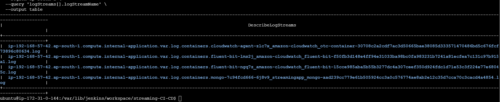

**Verification**

Application and container log streams were visible in CloudWatch Logs, confirming centralized application logging.

---

# Step 35 — Scale Application and Verify Health

The application deployment was scaled to verify Kubernetes replica management and application health after scaling.

### Step 35.1 — Scale Deployment

**Important command**

```bash
kubectl scale deployment <deployment-name> --replicas=3
```

### Step 35.2 — Verify Pods

```bash
kubectl get pods -o wide
```

### Step 35.3 — Verify Deployment

```bash
kubectl get deployment <deployment-name>
```

### Step 35.4 — Verify Rollout

```bash
kubectl rollout status deployment/<deployment-name>
```

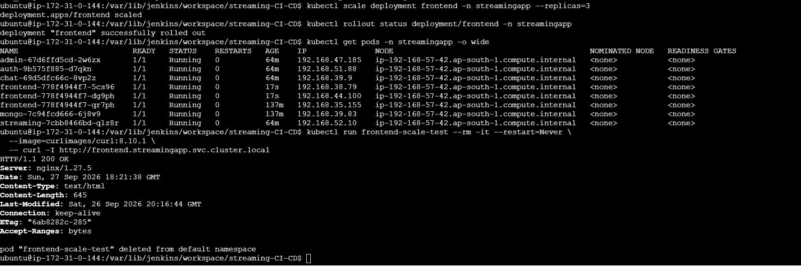

**Verification**

The application remained healthy after scaling and the expected replicas became available successfully.

---

# Project Architecture

The complete DevOps workflow implemented in this project is:

```text
GitHub Repository
       |
       v
Docker Images
       |
       v
Docker Compose Validation
       |
       v
Amazon ECR
       |
       v
Jenkins on EC2
       |
       v
GitHub Automatic Trigger
       |
       v
Jenkins CI/CD Pipeline
       |
       v
Docker Build / Tag / Push
       |
       v
Amazon ECR
       |
       v
Amazon EKS
       |
       v
Kubernetes
       |
       v
Helm Deployment
       |
       v
Application Services
       |
       +--------------------+
       |                    |
       v                    v
CloudWatch Monitoring   CloudWatch Logs
       |                    |
       v                    v
CloudWatch Alarm       Centralized Logging
       |
       v
Application Scaling
       |
       v
Health Validation
```

---

# Application Architecture

| Service | Port | Description |
|---|---:|---|
| `authService` | 3001 | User authentication, registration and JWT issuance |
| `streamingService` | 3002 | Video catalogue, S3 playback endpoints and public APIs |
| `adminService` | 3003 | Admin service for asset management and uploads |
| `chatService` | 3004 | WebSocket and REST chat for live watch parties |
| `frontend` | 3000 | React frontend application |
| `mongo` | 27017 | Shared MongoDB instance |

---

# Environment Configuration

## Auth Service

`backend/authService/.env`

```ini
PORT=3001
MONGO_URI=mongodb://localhost:27017/streamingapp
JWT_SECRET=changeme
CLIENT_URLS=http://localhost:3000
AWS_ACCESS_KEY_ID=
AWS_SECRET_ACCESS_KEY=
AWS_REGION=ap-south-1
AWS_S3_BUCKET=
```

## Streaming Service

`backend/streamingService/.env`

```ini
PORT=3002
MONGO_URI=mongodb://localhost:27017/streamingapp
JWT_SECRET=changeme
CLIENT_URLS=http://localhost:3000
AWS_ACCESS_KEY_ID=
AWS_SECRET_ACCESS_KEY=
AWS_REGION=ap-south-1
AWS_S3_BUCKET=
AWS_CDN_URL=
STREAMING_PUBLIC_URL=http://localhost:3002
```

## Admin Service

`backend/adminService/.env`

```ini
PORT=3003
MONGO_URI=mongodb://localhost:27017/streamingapp
JWT_SECRET=changeme
CLIENT_URLS=http://localhost:3000
AWS_ACCESS_KEY_ID=
AWS_SECRET_ACCESS_KEY=
AWS_REGION=ap-south-1
AWS_S3_BUCKET=
```

## Chat Service

`backend/chatService/.env`

```ini
PORT=3004
MONGO_URI=mongodb://localhost:27017/streamingapp
JWT_SECRET=changeme
CLIENT_URLS=http://localhost:3000
```

## Frontend

`frontend/.env`

```ini
REACT_APP_AUTH_API_URL=http://localhost:3001/api
REACT_APP_STREAMING_API_URL=http://localhost:3002/api
REACT_APP_STREAMING_PUBLIC_URL=http://localhost:3002
REACT_APP_ADMIN_API_URL=http://localhost:3003/api/admin
REACT_APP_CHAT_API_URL=http://localhost:3004/api/chat
REACT_APP_CHAT_SOCKET_URL=http://localhost:3004
```

---

# Running with Docker Compose

## Build and Start

```bash
docker-compose up --build
```

## Verify Containers

```bash
docker ps
```

## Open Application

```text
http://localhost:3000
```

---

# Local Development

## Auth Service

```bash
cd backend/authService
npm install
npm run dev
```

## Streaming Service

```bash
cd backend/streamingService
npm install
npm run dev
```

## Admin Service

```bash
cd backend/adminService
npm install
npm run dev
```

## Chat Service

```bash
cd backend/chatService
npm install
npm run dev
```

## Frontend

```bash
cd frontend
npm install
npm start
```

---

# Important Docker Commands

### Check Docker Version

```bash
docker --version
```

### List Images

```bash
docker images
```

### List Running Containers

```bash
docker ps
```

### Build Image

```bash
docker build -t <image-name>:<tag> .
```

### Tag Image for ECR

```bash
docker tag <image-name>:<tag> \
  <account-id>.dkr.ecr.ap-south-1.amazonaws.com/<repository>:<tag>
```

### Login to ECR

```bash
aws ecr get-login-password --region ap-south-1 | \
docker login \
  --username AWS \
  --password-stdin <account-id>.dkr.ecr.ap-south-1.amazonaws.com
```

### Push Image

```bash
docker push \
  <account-id>.dkr.ecr.ap-south-1.amazonaws.com/<repository>:<tag>
```

### Pull Image

```bash
docker pull \
  <account-id>.dkr.ecr.ap-south-1.amazonaws.com/<repository>:<tag>
```

---

# Important Kubernetes Commands

### Check Nodes

```bash
kubectl get nodes
```

### Check Pods

```bash
kubectl get pods -A
```

### Check Deployments

```bash
kubectl get deployments
```

### Check Services

```bash
kubectl get services
```

### Check Ingress

```bash
kubectl get ingress
```

### Describe Pod

```bash
kubectl describe pod <pod-name>
```

### View Pod Logs

```bash
kubectl logs <pod-name>
```

### Follow Pod Logs

```bash
kubectl logs -f <pod-name>
```

### Restart Deployment

```bash
kubectl rollout restart deployment <deployment-name>
```

### Check Rollout Status

```bash
kubectl rollout status deployment/<deployment-name>
```

### Scale Deployment

```bash
kubectl scale deployment <deployment-name> --replicas=3
```

---

# Important Helm Commands

### Check Helm Version

```bash
helm version
```

### Validate Chart

```bash
helm lint ./streamingapp
```

### Render Templates

```bash
helm template streamingapp ./streamingapp
```

### Install Release

```bash
helm install streamingapp ./streamingapp
```

### Upgrade Release

```bash
helm upgrade streamingapp ./streamingapp
```

### List Releases

```bash
helm list
```

### Check Release Status

```bash
helm status streamingapp
```

### View Release History

```bash
helm history streamingapp
```

---

# Important AWS and CloudWatch Commands

### Check EKS Cluster

```bash
aws eks describe-cluster \
  --name streamingapp-eks \
  --region ap-south-1
```

### Update kubeconfig

```bash
aws eks update-kubeconfig \
  --region ap-south-1 \
  --name streamingapp-eks
```

### List EKS Add-ons

```bash
aws eks list-addons \
  --cluster-name streamingapp-eks \
  --region ap-south-1
```

### Check CloudWatch Observability Add-on

```bash
aws eks describe-addon \
  --cluster-name streamingapp-eks \
  --addon-name amazon-cloudwatch-observability \
  --region ap-south-1 \
  --query 'addon.status' \
  --output text
```

### List CloudWatch Log Groups

```bash
aws logs describe-log-groups \
  --region ap-south-1 \
  --query 'logGroups[].logGroupName' \
  --output table
```

### List Application Log Streams

```bash
aws logs describe-log-streams \
  --log-group-name /aws/containerinsights/streamingapp-eks/application \
  --region ap-south-1 \
  --query 'logStreams[].logStreamName' \
  --output table
```

### List Container Insights Metrics

```bash
aws cloudwatch list-metrics \
  --namespace ContainerInsights \
  --region ap-south-1 \
  --query 'Metrics[].MetricName' \
  --output text
```

---

# Feature Highlights

- **S3-backed adaptive streaming** with secure signed uploads for administrators.
- **Dedicated admin microservice** for video ingestion, metadata management and featured content.
- **Real-time chat** using Socket.IO and persistent message history.
- **Modern React frontend** with responsive application pages.
- **Role-aware access control** across frontend routes and backend microservices.
- **Dockerized microservices** for consistent application deployment.
- **Jenkins CI/CD automation** for application image build and deployment.
- **Amazon ECR** for centralized Docker image storage.
- **Amazon EKS** for Kubernetes-based application deployment.
- **Helm** for Kubernetes application management.
- **CloudWatch** for monitoring, alarms and centralized logging.

---

# Project Completion

The complete application deployment was successfully implemented using modern DevOps tools and AWS services.

The project demonstrates:

- GitHub repository management
- Docker containerization
- Docker Compose
- Amazon ECR
- Jenkins CI/CD
- GitHub automatic triggering
- EC2-based Jenkins server
- IAM-based ECR access
- Amazon EKS
- Kubernetes
- Helm
- CloudWatch monitoring
- CloudWatch alarms
- Centralized CloudWatch logging
- Kubernetes application scaling
- Post-deployment application health validation

The application was successfully containerized, pushed to Amazon ECR, automated through Jenkins, deployed to Amazon EKS using Helm, monitored through CloudWatch, and validated after scaling.

-------------------------------------------------------------------------------------------------------
## StreamingApp

Stream premium video content, host live watch parties, and manage your catalogue with a modern microservice architecture. The platform now ships with a production-ready admin portal, real-time chat, S3-backed adaptive streaming, and a redesigned cinematic frontend experience.

Architecture
Service	Port	Description
authService	3001	User authentication, registration, JWT issuance
streamingService	3002	Video catalogue, S3 playback endpoints, public APIs
adminService	3003	Dedicated admin microservice for asset management and uploads
chatService	3004	Websocket + REST chat for live watch parties
frontend	3000	React SPA with revamped UI and integrated chat
mongo	27017	Shared MongoDB instance
All backend services share common database models and utilities through backend/common.

Environment Configuration
Create an .env for each service (or export variables before running). All services accept the standard AWS credentials for S3 access.

Auth Service (backend/authService/.env)
PORT=3001
MONGO_URI=mongodb://localhost:27017/streamingapp
JWT_SECRET=changeme
CLIENT_URLS=http://localhost:3000
AWS_ACCESS_KEY_ID=
AWS_SECRET_ACCESS_KEY=
AWS_REGION=ap-south-1
AWS_S3_BUCKET=
Streaming Service (backend/streamingService/.env)
PORT=3002
MONGO_URI=mongodb://localhost:27017/streamingapp
JWT_SECRET=changeme
CLIENT_URLS=http://localhost:3000
AWS_ACCESS_KEY_ID=
AWS_SECRET_ACCESS_KEY=
AWS_REGION=ap-south-1
AWS_S3_BUCKET=
AWS_CDN_URL=
STREAMING_PUBLIC_URL=http://localhost:3002
Admin Service (backend/adminService/.env)
PORT=3003
MONGO_URI=mongodb://localhost:27017/streamingapp
JWT_SECRET=changeme
CLIENT_URLS=http://localhost:3000
AWS_ACCESS_KEY_ID=
AWS_SECRET_ACCESS_KEY=
AWS_REGION=ap-south-1
AWS_S3_BUCKET=
Chat Service (backend/chatService/.env)
PORT=3004
MONGO_URI=mongodb://localhost:27017/streamingapp
JWT_SECRET=changeme
CLIENT_URLS=http://localhost:3000
Frontend build variables (frontend/.env or Docker build args)
REACT_APP_AUTH_API_URL=http://localhost:3001/api
REACT_APP_STREAMING_API_URL=http://localhost:3002/api
REACT_APP_STREAMING_PUBLIC_URL=http://localhost:3002
REACT_APP_ADMIN_API_URL=http://localhost:3003/api/admin
REACT_APP_CHAT_API_URL=http://localhost:3004/api/chat
REACT_APP_CHAT_SOCKET_URL=http://localhost:3004
Running with Docker Compose
Populate the environment variables above (or rely on the defaults baked into docker-compose.yml).
Build and start the stack:
docker-compose up --build
Navigate to http://localhost:3000 for the web app.
The compose file provisions MongoDB plus all four Node.js microservices. S3 credentials are optional for local testing—you can still browse seeded metadata, but streaming requires valid S3 objects.

Local Development
Install dependencies for each service:

# auth service
cd backend/authService && npm install

# streaming service
cd ../streamingService && npm install

# admin service
cd ../adminService && npm install

# chat service
cd ../chatService && npm install

# frontend
cd ../../frontend && npm install
Run the services (in separate terminals) after starting MongoDB:

cd backend/authService && npm run dev
cd backend/streamingService && npm run dev
cd backend/adminService && npm run dev
cd backend/chatService && npm run dev
cd frontend && npm start
Feature Highlights
S3-backed adaptive streaming with secure signed uploads for admins.
Dedicated admin microservice for video ingestion, metadata management, and featured curation.
Real-time chat overlay in the player (Socket.IO + persistent message history).
Modern React experience featuring cinematic hero sections, dynamic carousels, and responsive design.
Role-aware access control across frontend routes and backend microservices.
Testing
Automated tests are not yet included. Recommended smoke checks:

Register and log in through the web UI.
Upload a small video + thumbnail via the admin dashboard (requires valid S3 credentials).
Confirm playback from the browse page and verify that chat messages broadcast between multiple browser tabs.
License
MIT © StreamFlix Team